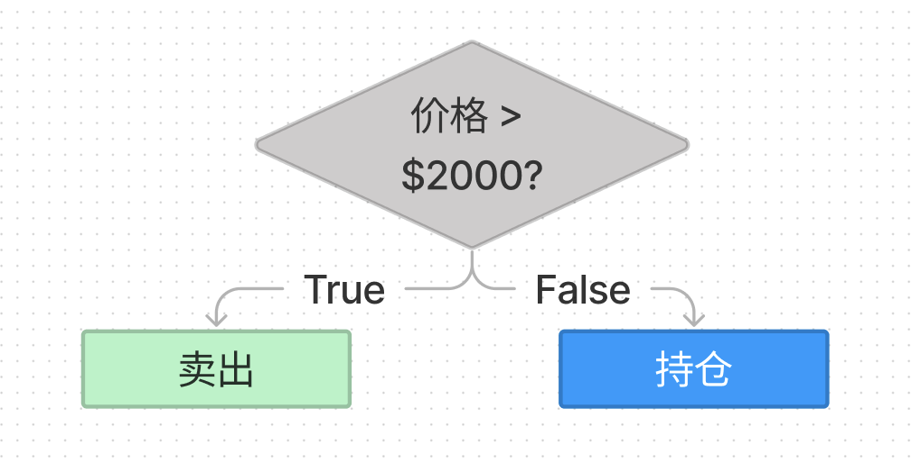

# WTF JavaScript 极简教程: 6. 条件语句

WTF JavaScript 教程，帮助新人快速入门 JavaScript。

**推特**：[@WTFAcademy\_](https://twitter.com/WTFAcademy_) ｜ [@0xAA_Science](https://twitter.com/0xAA_Science)

**WTF Academy 社群：** [官网 wtf.academy](https://wtf.academy/) | [WTF Solidity 教程](https://github.com/AmazingAng/WTFSolidity) | [discord](https://discord.wtf.academy/) | [微信群申请](https://docs.google.com/forms/d/e/1FAIpQLSe4KGT8Sh6sJ7hedQRuIYirOoZK_85miz3dw7vA1-YjodgJ-A/viewform?usp=sf_link)

所有代码和教程开源在 github: [github.com/WTFAcademy/WTF-JavaScript](https://github.com/WTFAcademy/WTF-JavaScript)

---

在投资中，我们经常会根据价格不同而采取不同的策略。这一讲，我们介绍 JavaScript 中的条件语句，它可以让我们做到根据不同条件执行不同的操作。



## if 语句

`if` 语句的基本结构如下：

```js
if (条件) {
  语句
}
```

当 `if` 语句的条件为  `true` 时，则会执行对应的代码块。例如：

```js
let x = 1;
if (x > 0) {
  x = x + 1;
}
console.log(x); // 2
```

`if` 语句会计算圆括号内的表达式，并将计算结果转换为布尔类型，下列值将会被计算为 `false` ：

- `false`
- `undefined`
- `null`
- `0`
- `NaN`
- 空字符串（`""`）

当传递给 `if` 语句所有其他的值，包括所有对象会被计算为 `true`

## if-else 语句

`if` 代码块后还可以跟随一个 `else` 代码块，如果判断条件不成立，则会执行它内部的代码。

```js
let y = 1;
if (y != 1) {
  y = y + 1;
} else {
  y = y - 1;
}
console.log(y); // 0
```

## else-if 语句

有时我们需要进行多次判断，可以通过使用  `else-if` 语句实现：

```js
const z = 2;

if (z === 0) {
  console.log('x 的值为 0');
} else if (z === 1) {
  console.log('x 的值为 1');
} else if (z === 2) {
  console.log('x 的值为 2');
} else {
  console.log('x 为其它值');
}
```

## 三元运算符

三元运算符，也称条件运算符，是 JavaScript 唯一使用三个操作数的运算符。使用规则： `条件 ? 表达式1 : 表达式2`。当条件为真时，执行`表达式1`，否则执行`表达式2`。该运算符经常当作 `if-else` 语句的简捷形式来使用。例如：

```js
// 返回 x 和 z 之中更大的数
const bigger = x < z ? z : x;
console.log(bigger);
```

## 习题

补全下面的 `isOdd` 函数，完成逻辑: 当输入参数 `num` 为奇数时，返回 `true`，偶数时返回 `false`。

> 提示：可以使用取余运算符 `%` 来计算 `num` 与 2 的余数。如果是 0，则为偶数；如果是 1，则为奇数。

```js
function isOdd(num){
}
```

## 总结

这一讲我们介绍了 JavaScript 的条件语句，包括 `if`，`if-else`，`else-if`，和三元运算符。它们可以丰富程序的逻辑性。
