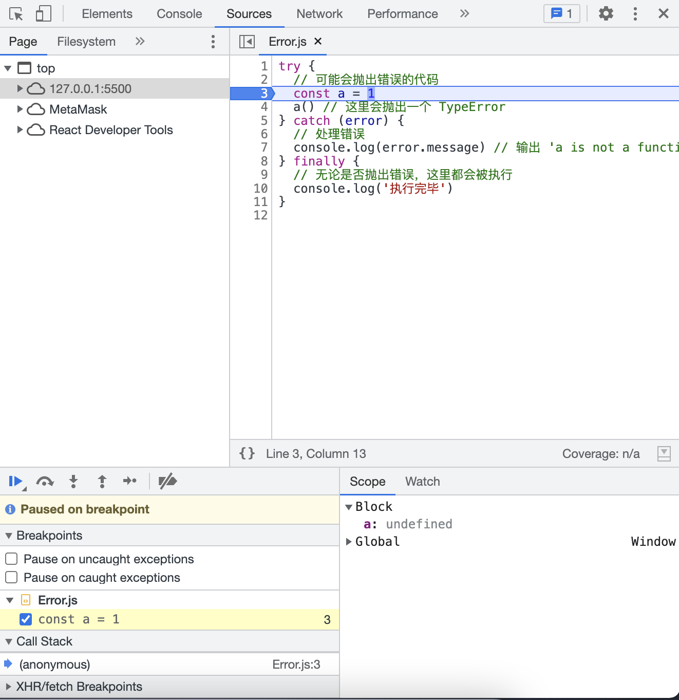

# WTF JavaScript 极简教程 18. 异常处理

WTF JavaScript 教程，帮助新人快速入门 JavaScript。

**推特**：[@WTFAcademy_](https://twitter.com/WTFAcademy_) ｜ [@0xAA_Science](https://twitter.com/0xAA_Science)

**WTF Academy 社群：** [官网 wtf.academy](https://wtf.academy/) | [WTF Solidity 教程](https://github.com/AmazingAng/WTFSolidity) | [discord](https://discord.wtf.academy/) | [微信群申请](https://docs.google.com/forms/d/e/1FAIpQLSe4KGT8Sh6sJ7hedQRuIYirOoZK_85miz3dw7vA1-YjodgJ-A/viewform?usp=sf_link)

所有代码和教程开源在 github: [github.com/WTFAcademy/WTF-Javascript](https://github.com/WTFAcademy/WTF-Javascript)

---

在 JavaScript 编程中，错误处理和调试是必备的技能。无论你的代码编写得多么完美，错误总是难以避免的。在这一章节中，我们将介绍如何使用 try...catch 语句处理错误，以及如何使用浏览器的开发者工具进行调试。

## try...catch 语句

JavaScript 提供了 `try...catch` 语句来捕获和处理运行时错误。你可以将可能会抛出错误的代码放在 `try` 块中，然后在 `catch` 块中处理错误。

```javascript
try {
  // 可能会抛出错误的代码
  const a = 1
  a() // 这里会抛出一个 TypeError
} catch (error) {
  // 处理错误
  console.log(error.message) // 输出 'a is not a function'
}
```

如果 `try` 块中的代码没有抛出错误，那么 `catch` 块将不会被执行。如果 `try` 块中的代码抛出了错误，那么 `catch` 块将被执行，你可以在其中访问到错误对象。

## finally 语句

`try...catch` 语句还可以包含一个 `finally` 块，它会在 `try` 块中的代码执行完毕后被执行，无论是否抛出了错误。

```javascript
try {
  // 可能会抛出错误的代码
  const a = 1
  a() // 这里会抛出一个 TypeError
} catch (error) {
  // 处理错误
  console.log(error.message) // 输出 'a is not a function'
} finally {
  // 无论是否抛出错误，这里都会被执行
  console.log('执行完毕')
}
```

## throw 语句

你也可以使用 `throw` 语句来抛出一个错误。`throw` 语句接受一个错误对象作为参数，你可以在其中指定错误的类型和错误的信息。

```javascript
function divide(x, y) {
  if (y === 0) {
    throw new Error('除数不能为 0')
  }
  return x / y
}

try {
  const result = divide(10, 0)
  console.log(result)
} catch (error) {
  console.log(error.message)
}
```

## 调试：浏览器的开发者工具

大部分的浏览器都有内置的开发者工具，你可以使用它们来调试你的 JavaScript 代码。开发者工具提供了许多强大的功能，包括断点、单步执行、查看变量值等等。

你可以通过以下步骤来打开开发者工具：

1. 打开浏览器。
2. 右键点击网页，选择 “检查” 或 “审查元素”。
3. 切换到 “Console” 或 “Sources” 标签。

在开发者工具中，你可以查看到所有的 JavaScript 错误，包括错误的类型、错误的信息，以及错误发生的位置。



你还可以在代码中的任何位置设置断点。当代码执行到断点的时候，它将会暂停，你可以查看变量的值，或者单步执行代码。

## 总结

JavaScript 错误处理是一项重要的任务可以帮助我们避免程序崩溃或产生不良影响。当我们编写 JavaScript 代码时，应该时刻考虑错误处理，并编写适当的代码来处理可能出的错误。另外，我们还可以借助浏览器的开发者工具来调试我们的代码。
